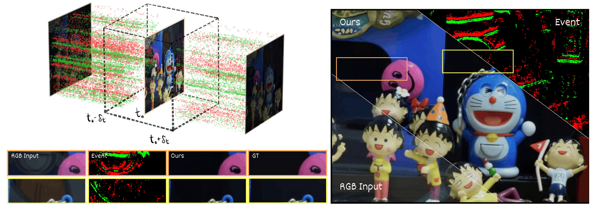

# E-SIRR
Dynamic Reflection Removal from RGB Images via Event-Guided Multimodal Approach

This is the official implementation of the paper accepted for publication at the **EBMV** workshop during the **19th European Conference on Computer Vision -- ECCV 2026**.
Code and data will be realeased soon.

---

  

**Authors:** Simone Melcarne, Sahar Husseini and Jean-Luc Dugelay || Eurecom Research Center, Data Science Department, Biot, France

---

