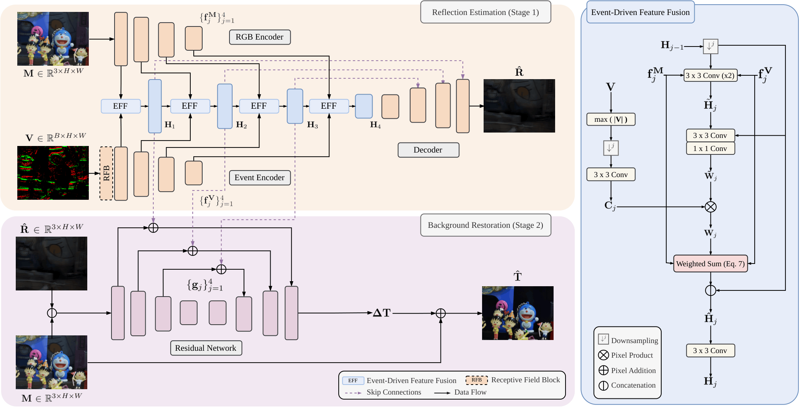

# E-SIRR: Dynamic Reflection Removal from RGB Images via Event-Guided Multimodal Approach

This is the official implementation of the paper accepted for publication at the **EBMV** workshop during the **19th European Conference on Computer Vision -- ECCV 2026**.


[](https://eventbasemultimodalvision.github.io/)
[](LICENSE)
[](https://pytorch.org/)

---

<p align="center">
  
</p>

**Authors:** Simone Melcarne, Sahar Husseini and Jean-Luc Dugelay || Eurecom Research Center, Data Science Department, Biot, France


---

## The Framework

<p align="center">
  
</p>

Single-image reflection removal is inherently ill-posed: the same mixture image $M$ is consistent with infinite valid (transmission, reflection) pairs. **E-SIRR** resolves this ambiguity with an auxiliary **event camera**, exploiting the assumption of a **static background and a moving reflection**: under this constraint, the asynchronous event stream exclusively captures the high-frequency edges of the moving reflection layer, giving the network an explicit structural cue.

The task is formulated as a two-stage estimation problem: given a mixture image $M \in \mathbb{R}^{3 \times H \times W}$ and a synchronized event voxel grid $V \in \mathbb{R}^{B \times H \times W}$,

$$\hat{R} = \mathcal{R}(M, V), \qquad \hat{T} = \mathcal{T}(M, V, \hat{R})$$

### Key Components

* **Event Voxel Grid:** events falling within a symmetric temporal window around the frame timestamp are converted into a fixed-size $B$-bin voxel grid via a triangular temporal kernel (Eq. 5 of the paper).
* **Stage 1 — Reflection Estimation Network:** a dual-branch encoder (RGB + event, 4 scales, Residual Blocks + Group Normalization) extracts multi-scale features $\{f_j^M\}$, $\{f_j^V\}$. Before entering the event encoder, the raw voxel grid is first processed by a **Receptive Field Block (RFB)** — three parallel dilated convolutions (rates 1, 2, 3) concatenated and fused via 1×1 conv — to expand the receptive field prior to downsampling.
* **Event-Driven Feature Fusion (EFF):** at every scale $j$, a spatial gating mask $W_j$ (modulated by an **Event Confidence Map** $C_j$, computed as the max absolute voxel intensity across temporal bins) dynamically balances RGB and event features:

$$\hat{H}_j = \big[(1-W_j) \odot f_j^M + W_j \odot f_j^V \,;\, H_{j-1}\big]$$

  letting the network discard the event contribution whenever $V$ is uninformative. A U-Net style decoder then predicts the intermediate reflection estimate $\hat{R}$.
* **Stage 2 — Background Restoration Network:** $M$ and $\hat{R}$ are concatenated (6 channels) and processed by a second residual encoder. **Cross-stage connections** re-inject the fused features $\{H_j\}$ from Stage 1 (through a zero-initialized 1×1 conv) to prevent high-frequency detail loss. The decoder predicts a residual $\Delta T$, added to $M$ to recover the clean transmission $\hat{T}$.
* **Composite Objective:** pixel (L1) + perceptual (VGG-19, relu1_2/relu2_2) losses supervise both stages, plus a multi-scale **exclusion loss** (3 pyramid levels) that explicitly discourages structural overlap between $\hat{T}$ and $\hat{R}$:

$$\mathcal{L}_{total} = \mathcal{L}_R(\hat{R}, R) + \mathcal{L}_T(\hat{T}, T) + \omega_e\, \mathcal{L}_{excl}(\hat{T}, \hat{R})$$

  with $\omega_\ell = 1.0$, $\omega_\phi = 0.1$, $\omega_e = 0.02$.

---

## Dataset Preparation
 <!-- TODO
Training requires triplets of mixture $M$, event voxel grid $V$, and ground-truth transmission/reflection layers $T$, $R$. The model is trained on a **large-scale synthetic dataset** built from COCO and evaluated both cross-dataset on **SIR²⁺** and on a **real-world event-camera benchmark (ER-100)** collected by the authors.

### 1. Download / Build Data

1. **COCO Dataset (source images for synthetic background/reflection pairs):**
   Official dataset page: [https://cocodataset.org/](https://cocodataset.org/)

2. **DVS-Voltmeter (event stream simulator):**
   Used to simulate the synchronized event stream from the synthesized mixture frame sequence — official repository: [https://github.com/Lynn0306/DVS-Voltmeter](https://github.com/Lynn0306/DVS-Voltmeter)

3. **SIR²⁺ Dataset (cross-dataset zero-shot evaluation, real RGB with T/R ground truth):**
   Official request page (ROSE Lab, NTU): [https://rose1.ntu.edu.sg/dataset/sir2Benchmark/](https://rose1.ntu.edu.sg/dataset/sir2Benchmark/)
   Only the subset with both transmission and reflection ground truth is used, since event simulation requires the reflection layer; events are simulated as for the synthetic set but **without** the Gaussian blur (SIR²⁺ reflections are already naturally blurred).

4. **ER-100 (real-world dataset, DAVIS346 event camera):**
   Captured by the authors (346×260 px, 5 scenes, 138 multimodal testing samples) as a preliminary real-world benchmark.
   <!-- TODO: aggiungi qui il link di download (Drive/HF/repo release) una volta che ER-100 è pubblicato

### 2. Synthetic Data Generation Pipeline

The synthetic dataset is generated on the fly / offline from COCO image pairs following the paper's protocol:
1. Sample two random COCO images as background $T$ and reflection $R$.
2. Apply a random Gaussian blur to the reflection: $R_G = G(R;\sigma)$, $\sigma \in [1.1, 3.0]$.
3. Animate $R_G$ over $K$ frames along a smooth 2D cubic-spline trajectory (static background).
4. Blend each frame via non-linear screen blending: $M^{(i)} = \alpha T + \beta R_G^{(i)} - \alpha T \cdot \beta R_G^{(i)}$, with $\alpha \in [0.70, 0.85]$, $\beta \in [0.35, 0.60]$.
5. Feed the frame sequence to DVS-Voltmeter to simulate events, then accumulate them in a symmetric ±16 ms window around the midpoint frame and convert to a $B{=}5$-bin voxel grid.

Total dataset size: 9,418 samples (80:20 train/validation split).

### 3. Folder Structure

<!-- TODO: non ho ancora visto i file dataset/*.py per questo progetto — la struttura seguente è indicativa, aggiornala una volta che mi mandi il dataset loader reale (nomi cartelle, formato file per M, V, T, R)

```text
/path/to/your/data/
│
├── synthetic/                  # Generated from COCO via the pipeline above
│   ├── mixture/                # M
│   ├── voxel/                  # V (.npy)
│   ├── transmission/           # T (ground truth)
│   └── reflection/             # R (ground truth)
│
├── sir2plus/                   # SIR²⁺ subset with T/R ground truth (cross-dataset eval)
│   ├── mixture/
│   ├── voxel/                  # simulated, no Gaussian blur
│   ├── transmission/
│   └── reflection/
│
└── er100/                      # Real-world DAVIS346 benchmark
    ├── mixture/                # grayscale APS frames
    ├── events/                 # native asynchronous event streams / voxel grids
    └── target/                 # clean static ground-truth frame
```

---

## Installation

1. **Clone the repository**

```bash
git clone https://github.com/simonemelc/E-SIRR.git
cd E-SIRR
```

2. **Create and activate the environment**

```bash
conda create -n esirr python=3.9 -y
conda activate esirr
```

3. **Install dependencies**

```bash
pip install -r requirements.txt
```

4. **Download our pretrained model**

```bash
└── checkpoints/
    └── best_model.pth
```

<!-- TODO: aggiungi il link Google Drive/HF con i pesi pretrained

---

## Usage

### Training

```bash
python train.py \
  --root_mixture ./data/synthetic/mixture \
  --root_voxel ./data/synthetic/voxel \
  --root_transmission ./data/synthetic/transmission \
  --root_reflection ./data/synthetic/reflection \
  --batch_size 4 \
  --epochs 200 \
  --lr 1e-4 \
  --voxel_bins 5 \
  --crop_size 320 \
  --w_perc 0.1 \
  --w_excl 0.02 \
  --device 0
```

### Evaluation

Cross-dataset zero-shot evaluation on SIR²⁺:

```bash
python test.py \
  --ckpt ./checkpoints/best_model.pth \
  --root_mixture ./data/sir2plus/mixture \
  --root_voxel ./data/sir2plus/voxel \
  --root_target ./data/sir2plus/transmission \
  --metrics psnr ssim lpips \
  --device 0
```

Real-world evaluation on ER-100:

```bash
python test.py \
  --ckpt ./checkpoints/best_model.pth \
  --root_mixture ./data/er100/mixture \
  --root_voxel ./data/er100/events \
  --root_target ./data/er100/target \
  --metrics psnr ssim lpips \
  --device 0
```

<!-- TODO: non ho ancora visto train.py / test.py / il modello per questo progetto — argomenti e nomi script sono un template plausibile basato sui componenti descritti nel paper (voxel bins, crop size, pesi delle loss) e sullo stile dei tuoi altri repo. Mandameli e li sostituisco con quelli reali

---

## Citation

If you find this work useful, please cite:

```bibtex
@inproceedings{melcarne2026dynamic,
  author       = {Melcarne, Simone and Husseini, Sahar and Dugelay, Jean-Luc},
  title        = {Dynamic Reflection Removal from {RGB} Images via Event-Guided Multimodal Approach},
  booktitle    = {Proceedings of the European Conference on Computer Vision (ECCV)},
  year         = {2026}
}
```

<!-- TODO: aggiorna il BibTeX con i dati definitivi (pagine, DOI) non appena disponibili negli atti della conferenza. -->
